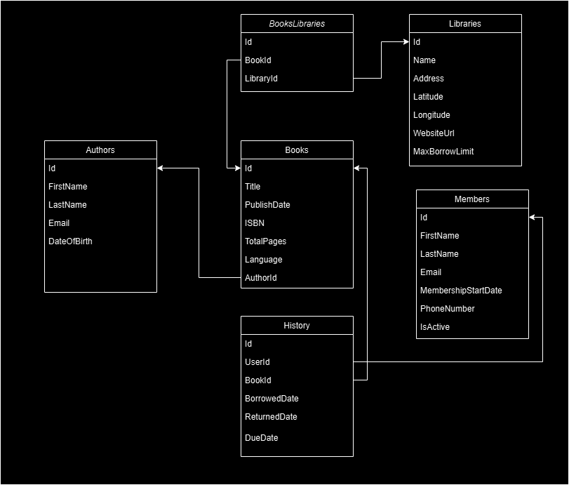

# Library Network API

This is a RESTful API built using ASP.NET Core for libraries network. It allows user to borrow books, that are stored in the libraries. Also it contains endpoint for libraries and books management.

## Table of Contents
- [Getting Started](#getting-started)
- [Database Structure](#database-structure)
- [API Endpoints](#api-endpoints)
  - [Libraries](#libraries)
    - [List All Libraries](#list-all-libraries)
    - [Filter Libraries](#filter-libraries)
    - [Update a Library](#update-a-library)
    - [Delete a Library](#delete-a-library)
  - [Books](#books)
    - [List All books](#list-all-books)
    - [Filter Books](#filter-books)
    - [Get Book Details](#get-book-details)
    - [Update Book](#update-book)
    - [Delete Book](#delete-book)
  - [Borrowing History](#borrowing-history)
    - [List History](#list-history)
    - [Filter Borrowing History](#filter-borrowing-history)
    - [Returning Book](#returning-book)
    - [Update History](#update-history)
    - [Delete History Record](#delete-history-record)


## Getting Started

This API allows administrators to perform the following operations:

- Retrieve a list of libraries.
- Filter libraries based on specific criteria.
- Update details of an existing library.
- Delete an existing library.

## Database Structure



## API Endpoints

### Libraries

#### 1. List All Libraries

**Description:** Fetches all the libraries from the database.

- **URL:** `/api/v1/libraries`
- **Method:** `GET`

#### Response Example:
```json
{
  "status": 200,
  "errors": [
    "string"
  ],
  "isSuccess": true,
  "data": [
    {
      "id": 0,
      "name": "string",
      "address": "string",
      "latitude": "string",
      "longitude": "string",
      "websiteUrl": "string",
      "maxBorrowLimit": 0
    }
  ]
}
```

#### 2. Filter Libraries

**Description:** Fetches libraries from the database with specific filter.

- **URL:** `/api/v1/libraries`
- **Method:** `POST`

#### Request Filter Example:
```json
{
  "id": 0,
  "name": "string"
}
```

#### Response Example:
```json
{
  "status": 200,
  "errors": [
    "string"
  ],
  "isSuccess": true,
  "data": [
    {
      "id": 0,
      "name": "string",
      "address": "string",
      "latitude": "string",
      "longitude": "string",
      "websiteUrl": "string",
      "maxBorrowLimit": 0
    }
  ]
}
```

#### 3. Update Library

**Description:** Create new or update existing library.

- **URL:** `/api/v1/libraries`
- **Method:** `POST`
- **WARNING!**: If Id field in request model is 0, endpoint will create new library, otherwise update information for existing library

#### Request Filter Example:
```json
{
  "id": 0,
  "name": "string",
  "address": "string",
  "latitude": "string",
  "longitude": "string",
  "websiteUrl": "string",
  "maxBorrowLimit": 0
}
```

#### Response Example:
```json
{
  "status": 0,
  "errors": [
    "string"
  ],
  "isSuccess": true
}
```

#### 4. Delete Library

**Description:** Delete library from the database.

- **URL:** `/api/v1/libraries/{id}`
- **Method:** `DELETE`
- **Warn**: If Id field in request model is 0, endpoint will create new library, otherwise update information for existing library

#### Request Parameters

- **Path Parameter**:
  - `id` (integer, required): The unique ID of the library to be deleted. Must be a positive integer.

#### Response Example:
```json
{
  "status": 0,
  "errors": [
    "string"
  ],
  "isSuccess": true
}
```

### Books

#### 1. List All Books

**Description:** Fetches all the books from the database.

- **URL:** `/api/v1/books`
- **Method:** `GET`

#### Response Example:
```json
{
  "status": 0,
  "errors": [
    "string"
  ],
  "isSuccess": true,
  "data": [
    {
      "id": 0,
      "title": "string",
      "publishedDate": "2024-10-25T06:51:30.996Z"
    }
  ]
}
```

#### 2. Filter Libraries

**Description:** Fetches books from the database with specific filter.

- **URL:** `/api/v1/books`
- **Method:** `POST`

#### Request Filter Example:
```json
{
  "id": 0,
  "title": "string",
  "authorName": "string",
  "isbn": "string",
  "libraryId": 0
}
```

#### Response Example:
```json
{
  "status": 0,
  "errors": [
    "string"
  ],
  "isSuccess": true,
  "data": [
    {
      "id": 0,
      "title": "string",
      "publishedDate": "2024-10-25T06:52:03.949Z"
    }
  ]
}
```

#### 3. Get Book Details

**Description:** Retrieve book details from the database.

- **URL:** `/api/v1/books/{id}`
- **Method:** `GET`

#### Request Parameters

- **Path Parameter**:
  - `id` (integer, required): The unique ID of the book. Must be a positive integer.

#### Response Example:
```json
{
  "status": 0,
  "errors": [
    "string"
  ],
  "isSuccess": true,
  "data": [
    {
      "id": 0,
      "title": "string",
      "publishedDate": "2024-10-25T06:54:12.072Z",
      "authorName": "string",
      "authorEmail": "string",
      "isbn": "string",
      "language": "string",
      "totalPages": 0
    }
  ]
}
```

#### 4. Update Book

**Description:** Create new or update existing library.

- **URL:** `/api/v1/books`
- **Method:** `POST`
- **WARNING!**: If Id field in request model is 0, endpoint will create new book, otherwise update information for existing book

#### Request Filter Example:
```json
{
  "id": 0,
  "title": "string",
  "publishedDate": "2024-10-25T06:52:00.974Z",
  "authorId": 0,
  "libraryId": 0,
  "isbn": "string",
  "language": "string",
  "totalPages": 0
}
```

#### Response Example:
```json
{
  "status": 0,
  "errors": [
    "string"
  ],
  "isSuccess": true
}
```

#### 5. Delete Book

**Description:** Delete book from the database.

- **URL:** `/api/v1/books/{id}`
- **Method:** `DELETE`

#### Request Parameters

- **Path Parameter**:
  - `id` (integer, required): The unique ID of the book to be deleted. Must be a positive integer.

#### Response Example:
```json
{
  "status": 0,
  "errors": [
    "string"
  ],
  "isSuccess": true
}
```

### Borrowing History

#### 1. List History

**Description:** Fetches all borrowing history records from the database.

- **URL:** `/api/v1/history`
- **Method:** `GET`

#### Response Example:
```json
{
  "status": 0,
  "errors": [
    "string"
  ],
  "isSuccess": true,
  "data": [
    {
      "id": 0,
      "memberName": "string",
      "bookTitle": "string",
      "borrowedDate": "2024-10-25T06:57:52.329Z",
      "returnedDate": "2024-10-25T06:57:52.329Z",
      "dueDate": "2024-10-25T06:57:52.329Z"
    }
  ]
}
```

#### 2. Filter Borrowing History

**Description:** Fetches borrowing history records from the database with specific fiolter.

- **URL:** `/api/v1/history`
- **Method:** `POST`

#### Request Filter Example:
```json
{
  "id": 0,
  "memberName": "string",
  "bookTitle": "string",
  "libraryId": 0
}
```

#### Response Example:
```json
{
  "status": 0,
  "errors": [
    "string"
  ],
  "isSuccess": true,
  "data": [
    {
      "id": 0,
      "memberName": "string",
      "bookTitle": "string",
      "borrowedDate": "2024-10-25T06:58:04.874Z",
      "returnedDate": "2024-10-25T06:58:04.874Z",
      "dueDate": "2024-10-25T06:58:04.874Z"
    }
  ]
}
```

#### 3. Returning Book 

**Description:** Sets returned at field in specific history record.

- **URL:** `/api/v1/history/{id}/return`
- **Method:** `PUT`

#### Request Parameters

- **Path Parameter**:
  - `id` (integer, required): The unique ID of the history record. Must be a positive integer.

#### Response Example:
```json
{
  "status": 0,
  "errors": [
    "string"
  ],
  "isSuccess": true
}
```

#### 4. Update History

**Description:** Create new or update existing borrowing history record. This operation means library member borrow a book.

- **URL:** `/api/v1/history`
- **Method:** `POST`
- **WARNING!**: If Id field in request model is 0, endpoint will create new history record, otherwise update information for existing history record

#### Request Filter Example:
```json
{
  "id": 0,
  "userId": 0,
  "bookId": 0,
  "borrowedDate": "2024-10-25T07:01:27.391Z",
  "dueDate": "2024-10-25T07:01:27.391Z"
}
```

#### Response Example:
```json
{
  "status": 0,
  "errors": [
    "string"
  ],
  "isSuccess": true
}
```

#### 5. Delete History Record

**Description:** Delete history record from the database.

- **URL:** `/api/v1/history/{id}`
- **Method:** `DELETE`

#### Request Parameters

- **Path Parameter**:
  - `id` (integer, required): The unique ID of the book to be deleted. Must be a positive integer.

#### Response Example:
```json
{
  "status": 0,
  "errors": [
    "string"
  ],
  "isSuccess": true
}
```


